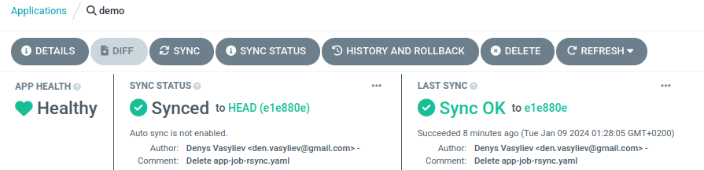

# Розгортання MVP (Minimum Viable Product) на прикладі ArgoCD

## Створити застосуток можна як через веб інтерфейс так і за за домопогою [CLI](#розгортання-застосунку-за-допомогою-argocd-cli)

### Створення нового застосунку

Перевіремо поточний контекст та за потреби надамо доступ через веб інтерфейс

```sh
k config current-context
k port-forward svc/argocd-server -n argocd 8080:443& 
```
Після авторизації створимо новий застосунок з потрібного нам репозитарію натиснувши на <kbd>NEW APP</kbd>.

Заповнемо необхідні поля в секціях General, Source та Destination:

    Applicaton Name: demo

    Project Name: default

    AUTO-CREATE NAMESPACE: yes

    Repository Url: https://github.com/den-vasyliev/go-demo-app

    Revision: HEAD

    Path: helm

    Cluster URL: https://kubernetes.default.svc

    Namespace: demo


За потреби змінюємо опціі в розділі *PARAMETERS*

Якщо все добре, створюємо застосунок натискаючи `CREATE`.
Перевіряємо чи все нас влаштовує за запускаємо синхронізацію, кнопка `SYNC`

Через деякий час SYNC STATUS має бути `Synced`, а APP HEALTH `Healthy`



Якщо цього не сталось перевіряємо налаштування.

### Розгортання застосунку за допомогою ArgoCD CLI

Виконуємо авторизацію в ArgoCD

```sh
➜ argocd login 127.0.0.1:8080 --username admin --password getpassword (argocd admin initial-password -n argocd)

WARNING: server certificate had error: tls: failed to verify certificate: x509: certificate signed by unknown authority. Proceed insecurely (y/n)? y

'admin:login' logged in successfully
Context '127.0.0.1:8080' updated
```
Створюємо застосунок та перевіряємо результат:

```sh
argocd app create demo \
--repo https://github.com/den-vasyliev/go-demo-app.git --path helm \
--dest-namespace demo --dest-server https://kubernetes.default.svc --grpc-web

argocd app get demo
```
Запускаємо синхронізацію:

```sh
argocd app sync demo 
```
Через деякий час STATUS має бути `Synced`, а HEALTH `Healthy`
Для перевірки виконаємо:

```sh
argocd app list demo

NAME         CLUSTER                         NAMESPACE  PROJECT  STATUS  HEALTH   SYNCPOLICY  CONDITIONS  REPO                                         PATH  TARGET
argocd/demo  https://kubernetes.default.svc  demo       default  Synced  Healthy  <none>      <none>      https://github.com/den-vasyliev/go-demo-app  helm  HEAD
```

### Перевірка працездатності застосунку `ambassador`

```sh
k port-forward -n demo svc/ambassador 8088:80&
[1] 3972717

curl localhost:8088
Handling connection for 8088
k8sdiy-api:599e1af
```

Надсилаємо тестове зображення

```sh
curl -F 'image=@/path_to_file/filename.png' localhost:8088/img/
```


Отримуємо згенеровану asciart-версію нашого файлу

Приклад:

```
                                     ..,::;;iiii111111iiii;;::,..                                     
                                .:;i111ttttttttt11tt1tttttttttt111i;:,.                               
                           .,;i1ttttt11111111111tt111111111111111ttttt1i;,.                           
                        ,:i1ttt1111111111111111ti:,11111111111111111111ttt1i:,                        
                     ,;1ttt1111111111111111111t:  :t11111111111111111111111ttt1;,                     
                  .:ittt111111111111111111111t:   :t11111111111111111111111111ttt1:.                  
                ,;1tt11111111111111111111111ti     it111111111t111111111111111111tt1;,                
              ,itt11111111111111111t11111111t,     .111111111t;;t1111111111111111111tti,              
            .itt111111111111111111111t111111t,      ,t111111t: it111111111111111111111tti.            
           ;1t11111111111111111111t;.;1111111.       :t1111t:  1111111111111111111111111tt;           
         ,1t1111111111111111111111ti  ,111111         it11t;   ;t1111111111111111111111111t1,         
        :tt11111111111111111111111t;   :t11t;         .1111.   .t11111111111111111111111111tt;        
       it1111111111111111111111111t,    it11.          :tt;     :t111111111111111111111111111ti.      
     .it1111111111111111111111111ti     ,tt;           .11.      ;t111111111111111111111111111t1.     
    .it111111111111111111111111111.     .ti             11        ;t111111111111111111111111111t1.    
    it11111111111111111111111111t,       ;.             i;         :t111111111111111111111111111ti    
   ;t11111111111111111111111111t;                       ;:          ;t111111111111111111111111111ti   
  ,t11111111111111111111111111ti                        ,,           it111111111111111111111111111t:  
  1111111111111111111111111111t,                         .           .111111111111111111111111111111. 
 :t11111111111111111111111111ti                                       it111111111111111111111111111t; 
 1111111111111111111111111111t:                                       :t11111111111111111111111111111.
,t111111111111111111111111111t,                                       :t1111111111111111111111111111t,
;t111111111111111111111111111t,                                       :t1111111111111111111111111111t;
it111111111111111111111111111t:                                       ;t1111111111111111111111111111ti
11111111111111111111111111111ti                                       11111111111111111111111111111111
11111111111111111111tt11111111t;                                     ;t111111111ttt1111111111111111111
11111111111111111111i111tttttt1t:                                   :t1ttttttt111i11111111111111111111
it111111111111111111. ..,,:;ii11t;.                               .;t11ii;::,,..  i11111111111111111ti
;t11111111111111111ti          ..,.                               ,,..           it11111111111111111t;
,t111111111111111111ti.                                                         it111111111111111111t,
 11111111111111111111t1,                                                      .it11111111111111111111.
 :t1111111111111111111tt:                                                    :1t1111111111111111111t; 
  1111111111111111111111ti,                                                .it1111111111111111111111. 
  ,t111111111111111111111t1iiiiiiiiiiiiiiiiiiiiiiiiiiiiiiiiiiiiiiiiiiiiiiii1t111111111111111111111t:  
   ;t1111111111111111111111tttttttttttttttttttttttttttttttttttttttttttttttt1111111111111111111111t;   
    it111111111111111111111:,,,,,,,,,,,,,,,,,,,,,,,,,,,,,,,,,,,,,,,,,,,,,,:111111111111111111111ti    
    .it11111111111111111111                                                1t111111111111111111t1.    
     .it1111111111111111111.                                              .1111111111111111111ti.     
       it111111111111111111                                                1t1111111111111111ti       
        :tt1111111111111111,,,,,,,,,,,,,,,,,,,,,,,,,,,,,,,,,,,,,,,,,,,,,,,,1111111111111111tt;        
         ,1t111111111111111tttttttttttttttttttttttttttttttttttttttttttttttt111111111111111t1,         
           ;1t1111111111111111111111i;;;;;;;;;;;;;;;;;;;;;;;;;;;;i1111111111111111111111t1;           
            .;tt1111111111111111111t;                            ;t1111111111111111111tti.            
              ,itt1111111111111111111,                          .1111111111111111111tti,              
                .;1tt11111111111111111,                        ,1t111111111111111tt1;,                
                  .:ittt11111111111111t;.                    .;t11111111111111ttti:.                  
                     ,;1ttt111111111111t1i:.              .:i1t111111111111ttt1;,                     
                        .:i1ttt1111111111ttt1i;::,,,,::;i11tt1111111111ttt1i:,                        
                           .,;i1ttttt11111111tttttttttttt11111111ttttt1i;,.                           
                                .,;ii11ttttttttt111111ttttttttt11ii;:.                                
                                      .,,:;;iiii111111iiii;;:,,..  
```