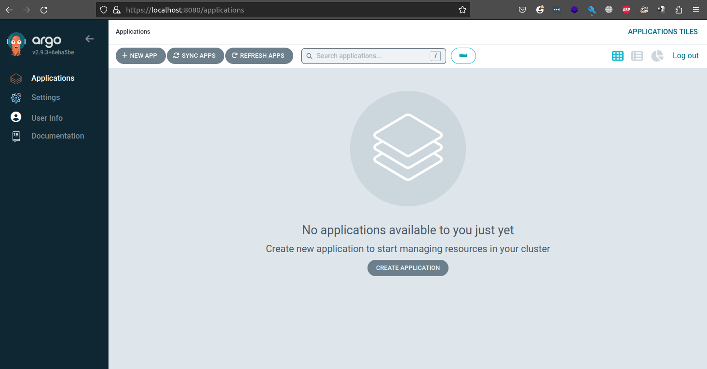

# Розгортання ArgoCD за допомогою k3d

Документація – <https://argo-cd.readthedocs.io/en/stable/>

### Створимо та перевіримо окремий локальний кластер

```sh
k3d cluster create argo
k cluster-info
k get all -A
```

### Створемо окремий Namespace argocd

```sh
k create namespace argocd

namespace/argocd created

k get ns
NAME              STATUS   AGE
default           Active   79m
kube-system       Active   79m
kube-public       Active   79m
kube-node-lease   Active   79m
argocd            Active   78m
```

```sh
k apply -n argocd -f https://raw.githubusercontent.com/argoproj/argo-cd/stable/manifests/install.yaml
k get all -n argocd
```

### Перевіремо устпішність старту ArgoCD

```sh
k get po -n argocd -w
NAME                                               READY   STATUS    RESTARTS   AGE
argocd-redis-b5d6bf5f5-fhjcx                       1/1     Running   0          35m
argocd-applicationset-controller-dc5c4c965-mq9m7   1/1     Running   0          35m
argocd-notifications-controller-db4f975f8-8jnlm    1/1     Running   0          35m
argocd-repo-server-579cdc7849-wbr67                1/1     Running   0          35m
argocd-server-557c4c6dff-ljmwv                     1/1     Running   0          35m
argocd-application-controller-0                    1/1     Running   0          35m
argocd-dex-server-9769d6499-q6g4l                  1/1     Running   0          35m
```
### Налаштовуємо переадресацію на локальний порт

```sh
k port-forward svc/argocd-server -n argocd 8080:443&
[1]  + 3947173 running    kubectl port-forward svc/argocd-server -n argocd 8080:443
Forwarding from 127.0.0.1:8080 -> 8080
Forwarding from [::1]:8080 -> 8080
Handling connection for 8080
```

Переходимо до вебінтерфейсу за посиланням [127.0.0.1:8080](https://127.0.0.1:8080/). 

За замовчуванням ArgoCD працює через https.

### Авторизація

Дефолтний username:  `admin`

Пароль можна отримати двома шляхами:

```sh
k -n argocd get secret argocd-initial-admin-secret -o jsonpath="{.data.password}"|base64 -d;echo
```

або:

```sh
argocd admin initial-password -n argocd

 This password must be only used for first time login. We strongly recommend you update the password using `argocd account update-password`.
```

argocd попередньо необхідно [встановити](https://argo-cd.readthedocs.io/en/stable/cli_installation)


